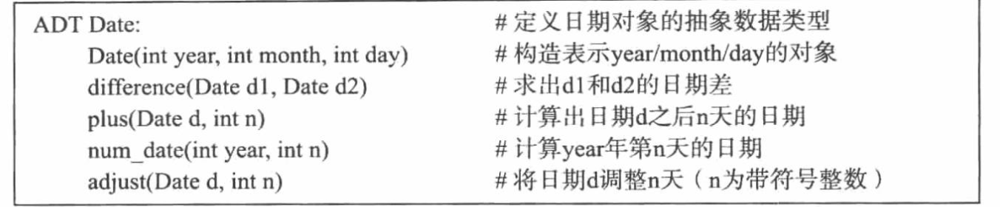

## 第二章 抽象数据类型##
> #### 概念 ####
> #### 描述 ####

## 正文 ##
### 1. 是*什么*？ 

**要解释ADT， 先要理解抽象(或者说数据抽象，与函数实现的计算抽象相对应)**

> ### 抽象 ###
#### 计算层面的抽象
+ 定义边界
+ 接口描述 （不限制实现方法）  
  - 如python函数，函数名和参数列表要求。
  - 保证调用时，符合函数要求

#### 数据层面的抽象
**围绕数据，将数据表示，和相关操作包装为一个整体**
- 模块接口 使用它提供功能的所有信息
- 模块实现 实现它提供的功能

> ### 类型 ###
它是数据相同点的抽象

### 2. 描述 ####

> ### ADT 是一种思想，也是组织程序的艺术 ###
 
+ 围绕一类数据定义程序模块
+ 模块的接口和实现分离
+ 实现数据表示和操作

