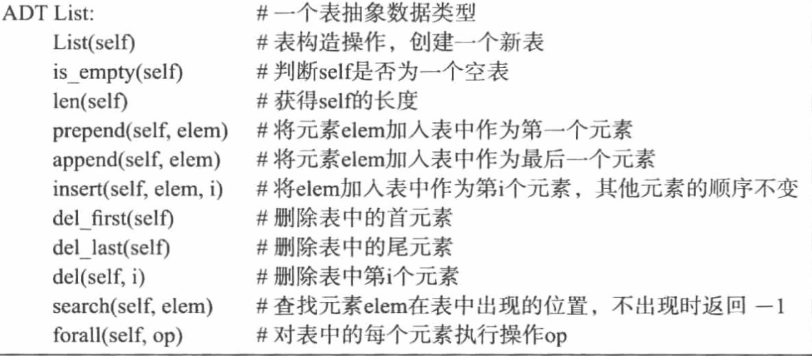
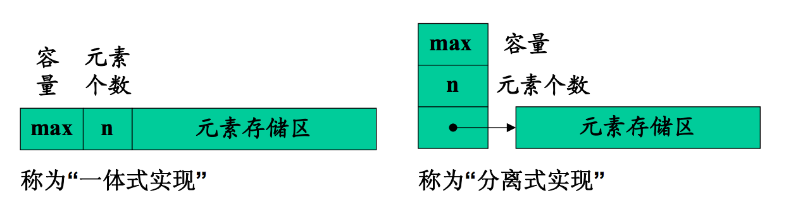
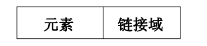
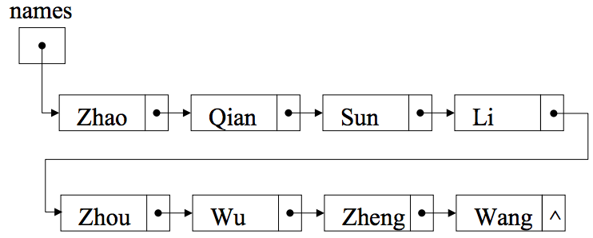
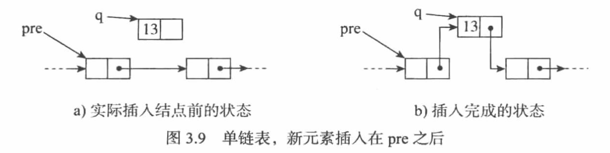
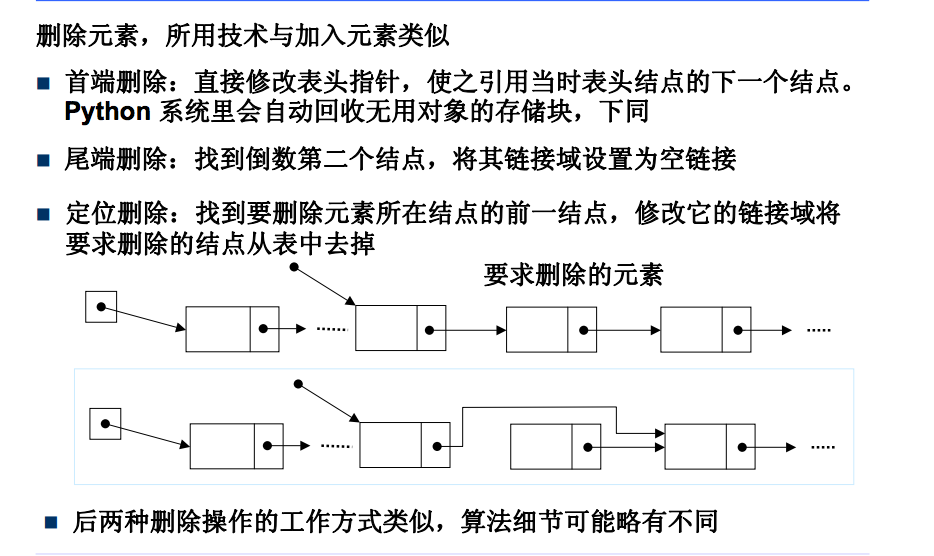

## 第三章 线性表 ##
> ### 为什么? ###
> ### 是什么? ###
> ### 什么样的情况下使用，优缺点是什么? ###

## 正文 ##
### 1. 为什么？ ###
  经常需要将一组数据元素，作为整体，管理和使用
### 2. 是什么？ ###
**维持元素线性关系的序列** 
(线性关系是： 1：能够找到表的首元素；2：从序列中的任意元素出发，都能找到它之后·的下一个元素)
   
  某类元素的集合，并记录它们之间的顺序
  它的ADT描述如下:
   
  

> ### 3. 什么样的情况下使用，优缺点是什么? ###
> ### 分类

> #### 顺序表 ####
  **表结构变化不频繁，要求查找效率高的情况下使用**
   
  存储区连续
  - 一个元素存储区
  - 若干个单元，存放一个表的全局信息（容量， 元素个数）

  
这种方式的优点与缺点都在于其元素的其中存储和连续性
+ 优点：
  
  + 查找方便，依据下标O(1)的时间复杂度内就能找到
  + 尾端插入也能在O(1)内找到
+ 缺点：
   + 添加删除的操作是O(n)
   + 如程序需要巨大表，则需要巨大块的连续存储空间

> #### 链接表 ####
  由顺序表的缺点，线性表的特性，我们接着可以设计这样表，
  给表中的单个元素申请一个空间，并让它记录下一个元素的地址。
  就是这样子的：
   
  

  + 单链表

  
  
  + 插入：（先断后连）

  

  + 删除 
  
    
  

