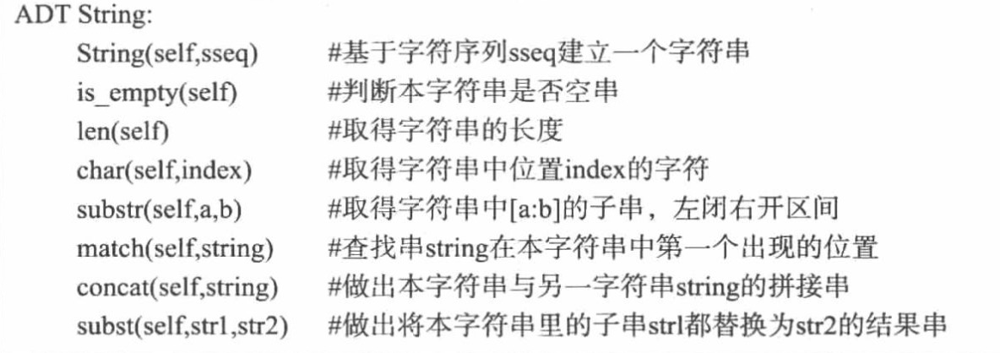
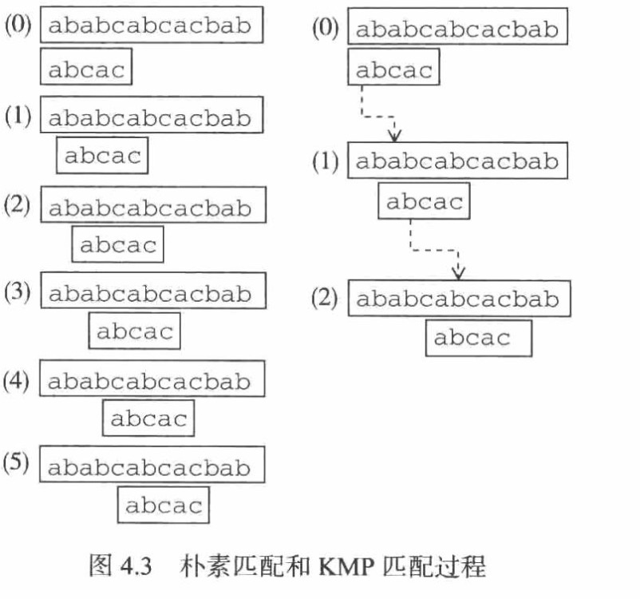

## 第四章 字符串 ##
> ### 为什么? ###
> ### 是什么? ###
> ### 什么样的情况下使用，优缺点是什么? ###

### 1. 为什么? ###
人与计算机交互，需要处理文字信息

### 2. 是什么? ###

+ 基本文字符号： 字符  字符的集合，构成字符集
+ 文字符号序列： 字符串

ADT 定义
 

### 3.什么样的情况下使用 ###

+ 字符串匹配
 + naive_match (假定字符集是无限的， 1对1依次匹配) 失败时，只向前移动一次
 + KMP （记录状态, 模式串对自身的认识）
    + 关键在于模式串匹配失败时，如何前移动 
    
    

    
    有一个结论： 对$p$中的每一个$i$，都有一个与之对应的下标$k_i$

